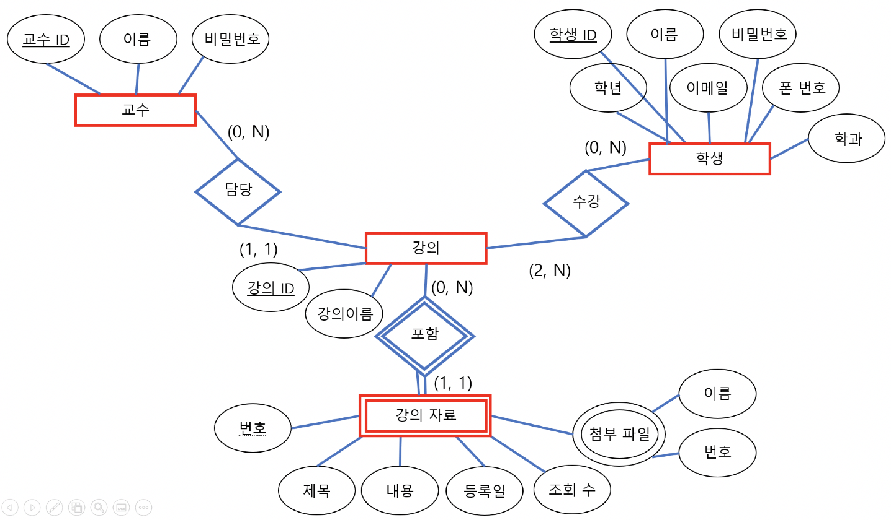
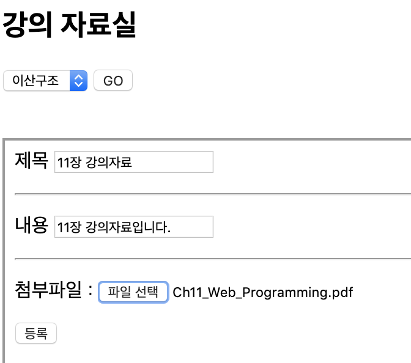

## Kwangwoon Univ. U-Campus(종합정보서비스)

&nbsp;&nbsp;&nbsp;&nbsp;&nbsp;&nbsp;&nbsp;&nbsp;&nbsp;&nbsp;&nbsp;&nbsp;&nbsp;&nbsp;&nbsp;&nbsp;&nbsp;&nbsp;&nbsp;&nbsp;&nbsp;&nbsp;&nbsp;&nbsp;&nbsp;&nbsp;&nbsp;&nbsp;&nbsp;&nbsp;&nbsp;&nbsp;&nbsp;&nbsp;&nbsp;&nbsp;&nbsp;&nbsp;&nbsp;&nbsp;&nbsp;&nbsp;&nbsp;&nbsp;&nbsp;&nbsp;&nbsp;&nbsp;&nbsp;&nbsp;&nbsp;&nbsp;&nbsp;&nbsp;&nbsp;&nbsp;&nbsp;&nbsp;&nbsp;&nbsp;*2019-1 데이터베이스 팀 프로젝트*

**JSP, Servlet, MySQL 을 사용하여 대학교 종합정보서비스(수강신청, 강의자료실, 이메일/SMS) 구현**

 

- **구현한 기능 소개**
  - 교수/학부생 로그인
  - 수강신청 - 학생들은 강의를 수강신청하거나 포기할 수 있음
  - 강의자료실 - 교수님은 강의 자료실에 첨부파일을 올릴 수 있고, 해당 과목을 수강하는 학생은 다운받을 수 있음
  - 전체 공지 - 교수님은 학생들을 선택해 이메일 또는 SMS 문자 메시지를 보낼 수 있음

 

- **사용한 언어 및 도구, 라이브러리**
  + JSP, Servlet
  + MySQL8, JDBC
  + Apache Tomcat
  + HTML, CSS, Javascript, Bootstrap
  + 파일 업로드/다운 - cos.jar  
  + 문자메시지 전송 -  javaSDK-2.2.jar, json-simple-1.1.1.jar  
  + 이메일 전송 - activation.jar, mail.jar

 

+ **개발 환경**
  + macOS Mojave
  + IntelliJ IDEA

 

- **프로젝트 구성원 및 개발 기간**
  + 광운대학교 소프트웨어학부 윤홍찬, 박준화, 김광호
  + 2019.5.11 ~ 6.18

 

- **ER Diagram**

  </img>

- **스크린샷**

  </img>

  

  

---

> 2019.11.5 최종 업데이트
>
> 광운대학교 소프트웨어학부 윤홍찬

